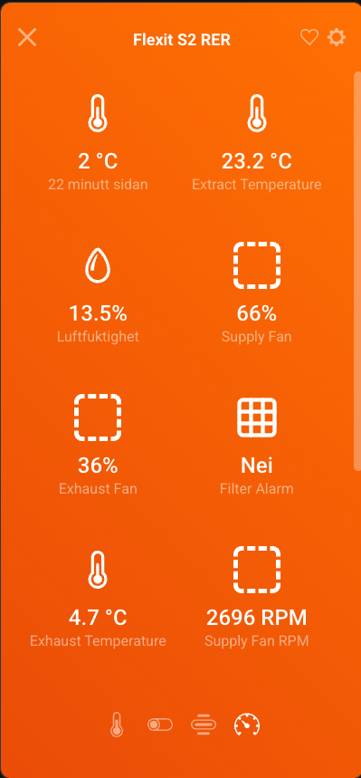
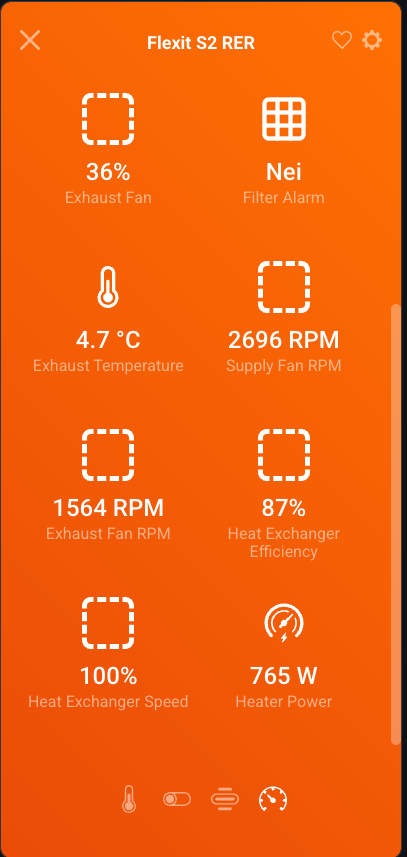
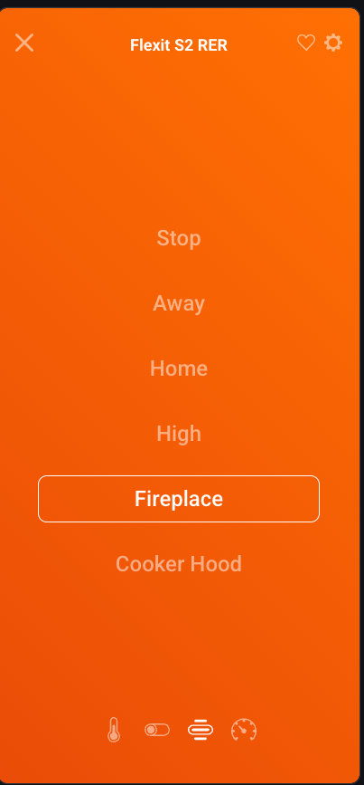
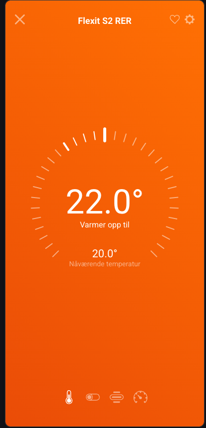

# Flexit Nordic BACnet

Control a [Flexit Nordic](https://www.flexit.no/) ventilation unit over BACnet/IP — from the command line or as a smart home device in [Homey](https://homey.app/).

<p align="center">
  
  
  
  
</p>

## Features

### Homey App (`homey-app/`)

A Homey SDK v3 app that exposes your Flexit Nordic unit as a native Homey device with full control and 16 sensor capabilities:

**Controls**
- Ventilation mode (Stop / Away / Home / High / Fireplace / Cooker Hood)
- Temperature setpoint
- Electric heater on/off

**Sensors**
- Temperatures: outside, supply, extract, exhaust
- Extract air humidity
- Fan speed % and RPM (supply + exhaust)
- Heat exchanger efficiency and rotor speed
- Electric heater power consumption (W)
- Air filter alarm

**Automation**
- Flow triggers: mode changed, filter polluted
- Flow conditions: is mode X, heater on, filter polluted
- Flow actions: set mode, set temperature, start fireplace/rapid ventilation, toggle heater

### CLI Tool (`flexit.py`)

A Python command-line tool for direct device control:

```
python3 flexit.py status              # Full device status
python3 flexit.py mode home           # Set ventilation mode
python3 flexit.py temp home 22.0      # Set temperature setpoint
python3 flexit.py fireplace on        # Start fireplace ventilation
python3 flexit.py rapid --minutes 30  # Start rapid ventilation
python3 flexit.py heater on           # Toggle electric heater
python3 flexit.py fan status          # Show fan setpoints
python3 flexit.py filter status       # Air filter info
python3 flexit.py discover            # Scan for devices on network
```

## Supported Devices

Flexit Nordic series ventilation units with BACnet/IP connectivity:

| Model | Series |
|---|---|
| S2 RER / S2 REL | Nordic S2 |
| S3 RER / S3 REL | Nordic S3 |
| S4 RER / S4 REL | Nordic S4 |
| CL2 RER / CL2 REL | Nordic CL2 |
| CL3 RER / CL3 REL | Nordic CL3 |
| CL4 RER / CL4 REL | Nordic CL4 |
| KS3 RER / KS3 REL | Nordic KS3 |

## Setup

### Homey App

```bash
cd homey-app
npm install
npx homey app install
```

The app will discover your Flexit unit automatically during pairing. You can also enter the IP address manually in device settings.

### CLI

```bash
pip install flexit_bacnet
python3 flexit.py --ip 192.168.1.128 status
```

## How It Works

The Flexit Nordic units expose a BACnet/IP interface on UDP port 47808. This project communicates with the unit using:

- **Homey app**: [node-bacstack](https://github.com/fh1ch/node-bacstack) for BACnet/IP transport
- **CLI**: [flexit_bacnet](https://github.com/piotrbulinski/flexit_bacnet) Python library

Device discovery uses Siemens Unconfirmed Private Transfer (vendor ID 7) — the same protocol used by the official Flexit Go app.

## Acknowledgements

- [piotrbulinski/flexit_bacnet](https://github.com/piotrbulinski/flexit_bacnet) — The Python BACnet client library for Flexit Nordic units. This project's BACnet object map and protocol implementation were ported from this excellent library.
- [fh1ch/node-bacstack](https://github.com/fh1ch/node-bacstack) — Node.js BACnet/IP stack used in the Homey app.

## License

MIT
